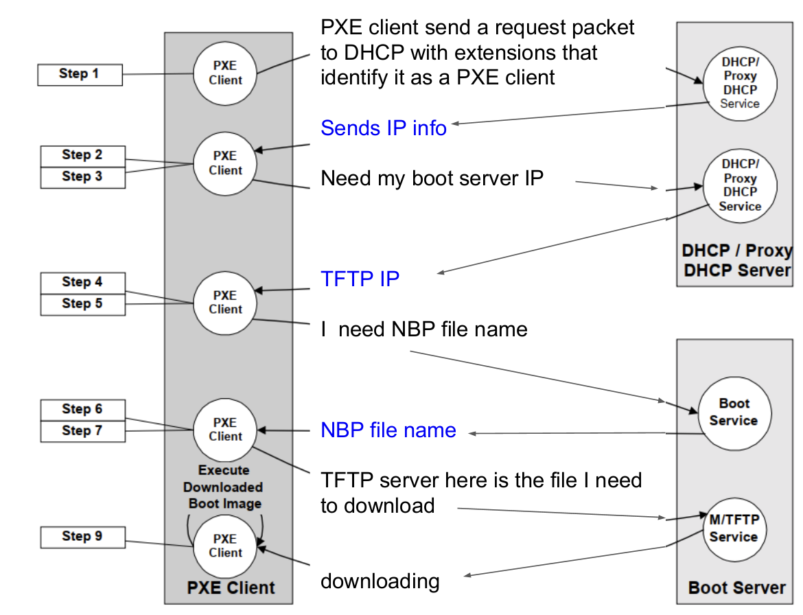
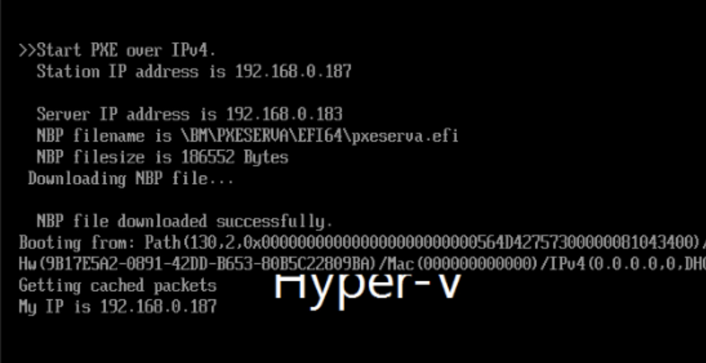
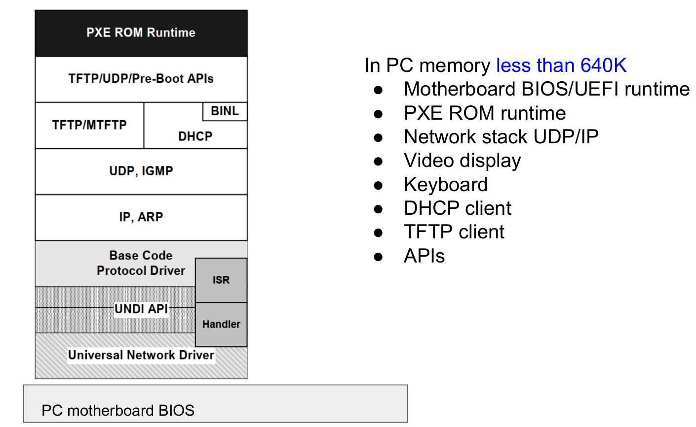

# CÀI ĐẶT VIRTUAL MACHINE TRÊN KVM THÔNG QUA PXE VÀ KICKSTART

## 1. Kiến thức tổng quan về PXE

PXE là một phần của Wired for Management (WfM) specification phát triển bởi Intel và Microsoft. PXE cho phép BIOS của máy tính và Network Interface Card (NIC) boot từ một nơi khác thông qua network.

PXE được thiết kế ra nhằm 3 mục đích chính

- Cài đặt/ xoá OS remote
- Remote emergency boot
- Remote network boot

**Sau đây, ta sẽ tập trung chính vào việc cài đặt OS remote**

Để boot được hệ điều hành sử dụng PXE ta cần một số thành phần sau:

- DHCP Server
- Client với BIOS w/PXE (BIOS có PXE)
- TFTP server để tải file NBP
- Server cung cấp images cho NBP load kernel

Sau đây, ta sẽ tìm hiểu các bước để cài đặt OS remote sử dụng PXE.

### 1.1. Retrieving IP using DHCP

Trước tiên, NIC cần lấy được IP của mình, của NBP server để có thể tiến hành booting.

Trước tiên, BIOS sẽ phải lấy IP của NIC thông qua DHCP. Sau đó lấy IP của TFTP server rồi tiến hành tải file NBP.

Ta có thể kiểm chứng qua trình này:

### 1.2. Booting process deep dive

Qua trình booting sẽ xảy ra như thế nào?

Tương tự với quá trình booting truyền thống, trước tiên firmware code ở trong ROM sẽ được lấy ra, tuy nhiên, đây sẽ không phải firmware thường mà là PXE ROM code. Chúng sẽ có thêm một số cơ chế để truyền thông qua mạng nhằm lấy được bootloader (thay vì như bình thường là ta lấy bootloader trên ổ đĩa). Bootloader này có tên là NBP.

Sau khi BIOS lấy được bootloader NBP. BIOS sẽ dừng hoạt động, công việc từ giờ trở đi sẽ do NBP phụ trách. NBP cũng như toàn bộ các bootloader khác, có nhiệm vụ load kernel của OS vào trong RAM rồi kết thúc hoạt động của mình, trao lại hoạt động cho OS kernel xử lý.
