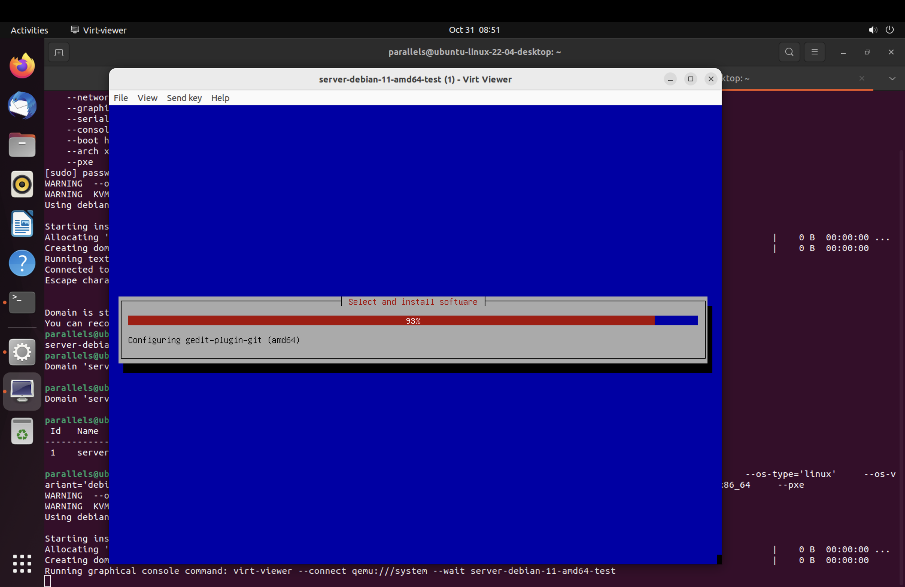

# TABLE OF CONTENTS

- [TABLE OF CONTENTS](#table-of-contents)
- [CÀI ĐẶT VIRTUAL MACHINE THÔNG QUA PXE VÀ KICKSTART/PRESEED](#cài-đặt-virtual-machine-thông-qua-pxe-và-kickstartpreseed)
  - [1. Kiến thức tổng quan về PXE](#1-kiến-thức-tổng-quan-về-pxe)
    - [1.1. Retrieving IP using DHCP](#11-retrieving-ip-using-dhcp)
    - [1.2. Booting process deep dive](#12-booting-process-deep-dive)
  - [2. Cài đặt OS với PXE và Kickstart/Preseed](#2-cài-đặt-os-với-pxe-và-kickstartpreseed)
    - [2.1. Xây dựng DHCP server](#21-xây-dựng-dhcp-server)
    - [2.2. Cấu hình TFTP server](#22-cấu-hình-tftp-server)
    - [3.2. Preseeding in Debian](#32-preseeding-in-debian)
- [REFERENCES](#references)

# CÀI ĐẶT VIRTUAL MACHINE THÔNG QUA PXE VÀ KICKSTART/PRESEED

## 1. Kiến thức tổng quan về PXE

PXE là một phần của Wired for Management (WfM) specification phát triển bởi Intel và Microsoft. PXE cho phép BIOS của máy tính và Network Interface Card (NIC) boot từ một nơi khác thông qua network.

PXE được thiết kế ra nhằm 3 mục đích chính

- Cài đặt/ xoá OS remote
- Remote emergency boot
- Remote network boot

**Sau đây, ta sẽ tập trung chính vào việc cài đặt OS remote**

Để boot được hệ điều hành sử dụng PXE ta cần một số thành phần sau:

- DHCP Server
- Client với BIOS w/PXE (BIOS có PXE)
- TFTP server để tải file NBP
- Server cung cấp images cho NBP load kernel

Sau đây, ta sẽ tìm hiểu các bước để cài đặt OS remote sử dụng PXE.

### 1.1. Retrieving IP using DHCP

Trước tiên, NIC cần lấy được IP của mình, của NBP server để có thể tiến hành booting.

Trước tiên, BIOS sẽ phải lấy IP của NIC thông qua DHCP. Sau đó lấy IP của TFTP server rồi tiến hành tải file NBP.


Ta có thể kiểm chứng qua trình này:


### 1.2. Booting process deep dive

Qua trình booting sẽ xảy ra như thế nào?

Tương tự với quá trình booting truyền thống, trước tiên firmware code ở trong ROM sẽ được lấy ra, tuy nhiên, đây sẽ không phải firmware thường mà là PXE ROM code. Chúng sẽ có thêm một số cơ chế để truyền thông qua mạng nhằm lấy được bootloader (thay vì như bình thường là ta lấy bootloader trên ổ đĩa). Bootloader này có tên là NBP.


Sau khi BIOS lấy được bootloader NBP. BIOS sẽ dừng hoạt động, công việc từ giờ trở đi sẽ do NBP phụ trách. NBP cũng như toàn bộ các bootloader khác, có nhiệm vụ load kernel của OS vào trong RAM rồi kết thúc hoạt động của mình, trao lại hoạt động cho OS kernel xử lý.

**More on Linux booting**

NBP sẽ chỉ thực hiện load một minimal Linux kernel và một số thành phần khác có khả năng load các phần còn lại.

Sau khi minimal kernel được load vào RAM. Kernel đồng thời sẽ load initrd (Init Ram Disk). Init Ram Disk là một Ram File System mà kernel sẽ sử dụng như root. Sau đó /sbin/init sẽ được execute. /sbin/init sẽ chuẩn bị để mount được "real" root FS (device type, device drives, file system, ..) và các distribution media như CD-ROM, network,... Sau đó /sbin/init sẽ load một số kernel modules, sau đó thực hiện mount root FS và initrd sẽ được unmount. Cuối cùng là thực hiện các task để cài đặt OS còn lại.

Mục đích chính của initrd là để có thể module hoá các thành phần cần thiết của linux kernel. Thay vì phải đóng gói một kernel kích thước lớn, initrd giúp ta load các module cần thiết cho kernel dễ dàng.

## 2. Cài đặt OS với PXE và Kickstart/Preseed

Như đã mô tả ở trên, ta set up một DHCP server để cung cấp IP của NBP server cho BIOS. Trước tiên ta sẽ sử dụng libvirt để tạo một mạng ảo sử dụng trong Lab này. Trước tiên ta tạo file cấu hình mạng

    vim br-pxe-net.xml

Sau đó cấu hình mạng như sau

```xml
    <network>
    <name>br-pxe</name>
    <forward mode='nat'>
        <nat>
        <port start='1024' end='65535'/>
        </nat>
    </forward>
    <bridge name='br-pxe' stp='on' delay='0'/>
    <ip address='192.168.177.1' netmask='255.255.255.0'>
    </ip>
    </network>
```

Sau đó ta tạo virtual network bằng virsh:

```sh
    sudo virsh net-define --file br-pxe-net.xml
```

Enable autostart cho mạng này:

```sh
    sudo virsh net-autostart br-pxe
```

Sau đó start mạng này:

```sh
    sudo virsh net-start br-pxe
```

Kiểm tra tình trạng mạng xem đã active chưa:

```sh
    parallels@ubuntu-linux-22-04-desktop:~$ sudo virsh net-list
    [sudo] password for parallels:
    Name      State    Autostart   Persistent
    --------------------------------------------
    br-pxe    active   yes         yes
    default   active   yes         yes
```

Tiếp theo, ta sẽ cài sử dụng virt-builder để xây dựng một VM. Ta sẽ sử dụng template Fedora 32:

```sh
    sudo virt-builder fedora-36  --format qcow2 \
    --size 32G -o /var/lib/libvirt/images/kvm-bastion-server.qcow2 \
    --root-password password:Phananh272
```

Ta sử dụng virt-install để chạy instance (ta tạm goị là server-fedora-32-x86_64) vừa build:

```sh
    --name server-fedora-32-x86_64 \
    --ram 2048 \
    --vcpus 2 \
    --disk path=/var/lib/libvirt/images/server-fedora-32-x86_64.qcow2 \
    --os-type='linux' \
    --os-variant='fedora32' \
    --network=bridge=br-pxe \
    --graphics none \
    --serial pty \
    --console pty \
    --boot hd \
    --import \
    --arch x86_64
```

Hiện tài VM của ta chưa có IP do chưa có DHCP server, ta sẽ cấu hình network manual cho server này

```sh
sudo nmcli con mod enp1s0 \
  ipv4.method manual \
  ipv4.address 192.168.177.2/24 \
  ipv4.gateway 192.168.177.1 \
  ipv4.dns 192.168.177.1 \
  connection.autoconnect yes
```

Restart interface:

```sh
sudo nmcli con down enp1s0 && sudo nmcli con up enp1s0
```

Sau khi cấu hình VM đã có IP 192.168.177.2:

```sh
[root@localhost tftpboot]# ip a
1: lo: <LOOPBACK,UP,LOWER_UP> mtu 65536 qdisc noqueue state UNKNOWN group default qlen 1000
    link/loopback 00:00:00:00:00:00 brd 00:00:00:00:00:00
    inet 127.0.0.1/8 scope host lo
       valid_lft forever preferred_lft forever
    inet6 ::1/128 scope host
       valid_lft forever preferred_lft forever
2: enp1s0: <BROADCAST,MULTICAST,UP,LOWER_UP> mtu 1500 qdisc fq_codel state UP group default qlen 1000
    link/ether 52:54:00:48:8b:10 brd ff:ff:ff:ff:ff:ff
    inet 192.168.177.2/24 brd 192.168.177.255 scope global noprefixroute enp1s0
       valid_lft forever preferred_lft forever
    inet6 fe80::74d4:e835:ef9b:b317/64 scope link noprefixroute
       valid_lft forever preferred_lft forever

```

### 2.1. Xây dựng DHCP server

Ta sẽ sử dụng server-fedora-32-x86_64 đồng thời làm DHCP server và TFTP server.

Trước tiên, ta sẽ cấu hình DHCP server cho server này. Cài đặt DHCP server package:

```sh
sudo dnf -y install dhcp-server
```

Chuyển file default configuration sang thành file backup:

```sh
sudo mv /etc/dhcp/dhcpd.conf{,.bak}
```

Tạo file dhcpd.conf mới vè tiến hành config:

```sh
sudo vim /etc/dhcp/dhcpd.conf
```

```sh
authoritative;
ddns-update-style interim;
default-lease-time 14400;
max-lease-time 14400;
allow booting;
allow bootp;

    #Default gateway
    option routers                  192.168.177.1;
    #DHCP network broadcast address
    option broadcast-address        192.168.177.255;
    #DHCP network subnet mask
    option subnet-mask              255.255.255.0;
    #IP address of DNS server
    option domain-name-servers      192.168.177.1;
    #Default NTP server
    option ntp-servers              time.google.com;
    #Default domain name
    option domain-name              "fedora32";

    subnet 192.168.177.0 netmask 255.255.255.0 {
      range 192.168.177.20 192.168.177.50;
      # this is PXE specific
      filename "pxelinux.0";
      #PXE Server IP Address
      next-server 192.168.177.2;
}
```

Ở đây, thông tin quan trọng nhất là ta phải cấu hình cho subnet 192.168.177.0/24 địa chỉ server có file NBP. Ở đây NBP có tên là "pxelinux.0" tại TFTP server. Ngoài ra, ta cần config DHCP server enable tính năng booting và bootp. Config này nhằm config DHCP server chấp nhận BOOTP queries để trả địa chỉ của TFTP cho client.

Sau đó, ta enable dhcpd:

```sh
sudo systemctl enable --now dhcpd
```

Kiểm tra status:

```sh
[root@localhost tftpboot]# systemctl status dhcpd
● dhcpd.service - DHCPv4 Server Daemon
     Loaded: loaded (/usr/lib/systemd/system/dhcpd.service; enabled; vendor pre>
     Active: active (running) since Mon 2022-10-31 07:47:06 +07; 2h 38min ago
       Docs: man:dhcpd(8)
             man:dhcpd.conf(5)
   Main PID: 503 (dhcpd)
     Status: "Dispatching packets..."
      Tasks: 1 (limit: 2342)
     Memory: 12.9M
        CPU: 644ms
     CGroup: /system.slice/dhcpd.service
             └─503 /usr/sbin/dhcpd -f -cf /etc/dhcp/dhcpd.conf -user dhcpd -gro>
```

### 2.2. Cấu hình TFTP server

Ta sẽ cấu hình TFTP server trên erver-fedora-32-x86_64 để cài đặt Debian 11. Debian đã cung cấp NBP chính thống trên trang chủ, nên ta chỉ cần config TFTP server để trả về file này cho client.

Ta cài TFTP package:

sudo dnf install tftp-server tftp -y

Tiếp theo ta cấu hình TFTP server trong file /usr/lib/systemd/system/tftp.service:

```sh
[Unit]
Description=Tftp Server
Requires=tftp.socket
Documentation=man:in.tftpd

[Service]
ExecStart=/usr/sbin/in.tftpd -s /tftpboot
StandardInput=socket

[Install]
Also=tftp.socket
```

Tại ExecStart ta chỉnh lại directoy để serve các file của tftp là /tftpboot thông qua -s.

Tiếp theo ta chỉ cần download directory cho netboot của Debian vào tftpboot để tiến hành boot qua network (file netboot.tar.gz tại https://deb.debian.org/debian/dists/bullseye/main/installer-amd64/current/images/netboot/). Tải về và giải nén rồi đưa các file vào trong /tftpboot.

Thư mục tftpboot có cấu trúc như sau:

```sh
[root@localhost tftpboot]# tree /tftpboot -L 3
/tftpboot
├── '
├── debian-installer
│   └── amd64
│       ├── bootnetx64.efi
│       ├── boot-screens
│       ├── grub
│       ├── grubx64.efi
│       ├── initrd.gz
│       ├── linux
│       ├── preseed.cfg
│       ├── pxelinux.0
│       └── pxelinux.cfg
├── ldlinux.c32 -> debian-installer/amd64/boot-screens/ldlinux.c32
├── pxelinux.0 -> debian-installer/amd64/pxelinux.0
├── pxelinux.cfg -> debian-installer/amd64/pxelinux.cfg
└── version.info
```

Như ta đã mô tả, BIOS sẽ load pxelinux.0 vào trước và thực hiện việc load kernel. Các file config để thực hiện tạo các menu cho việc load kernel. Ta sẽ custom các file cfg này để tiến hành automation cho quá trình cài đặt.

Cuối cùng là start service TFTP:

```sh
systemctl enable --now tftp-server
```

Nếu TFTP trả file bị permission denied, ta cần restorecon lại folder /tftproot:

    restorecon -Rv /tftproot

### 3.2. Preseeding in Debian

Sau khi BIOS load pxelinux.0 vào RAM, trên màn hình sẽ hiển thị các option cho ta chọn các lựa chọn boot kernel. Nếu ta chọn lựa chọn đầu tiên là Install tại màn hình boot, quá trình boot sẽ thực hiện như cài OS bình thường là ta sẽ load kernel vào, kernel thực hiện một số tác vụ khác rồi tiền hành cài đặt thêm các module OS. Việc cài đặt OS sẽ đòi hỏi người dùng phải nhập các thông tin như ngôn ngữ, bàn phìm, mật khẩu root, tài khoản thường, mật khẩu thường, partition, GRUB installation,...

Tuy nhiên, hiện tại ta cần phải automation. Debian có hỗ trợ automation thông qua preseeding (với một số OS khác như CentOS,... thì gọi là Kickstart, chúng có mục đích như nhau). Đây là một file để trả lời tất cả các câu hỏi trong việc cài đặt OS như ngôn ngữ, bàn phím kể trên,... Để có thể add được file preseeding này trong qúa trình boot ta cần config lại file pxelinux.cfg/default như sau:

```sh
[root@localhost tftpboot]# cat pxelinux.cfg/default
# D-I config version 2.0
# search path for the c32 support libraries (libcom32, libutil etc.)
path debian-installer/amd64/boot-screens/
include debian-installer/amd64/boot-screens/menu.cfg
default debian-installer/amd64/boot-screens/vesamenu.c32
prompt 0
timeout 100
ontimeout debian-preseed

label debian-preseed
	menu label ^Debian preseed
	kernel debian-installer/amd64/linux
	append auto=true priority=critical vga=788 initrd=debian-installer/amd64/initrd.gz url=tftp://192.168.177.2/debian-installer/amd64/preseed.cfg --- quiet

```

Ta sẽ timeout màn hình chọn chế độ boot trong 10s bằng timeout. Sau đó, nếu timeout thì ta chọn việc cài đặt tự động thông qua debian-preseed. Tại đây, ta thêm biến url để pass file preseed.cfg vào trong quá trình kernel cài đặt OS. File này ta đặt luôn ở server TFTP mà server quá trình netboot. Tuy nhiên, ta hoàn toàn có thể sử dụng một server khác cũng như giao thức khác như HTTP,...

Trong file pressed.cfg trả lời một số câu hỏi trong quá trình cài đặt, file này ta lấy từ [example được khuyến nghị bởi Debian](https://www.debian.org/releases/buster/example-preseed.txt), ta chỉ custom lại việc thêm mật khẩu root và thêm tài khoản, mật khẩu người dùng [preseed.cfg](/Lab_PXE/files/preseed.cfg) và config device để cài GRUB:

```sh
d-i passwd/root-password password Phananh272
d-i passwd/root-password-again password Phananh272

d-i passwd/user-fullname string anhphantq
d-i passwd/username string anhphantq

d-i passwd/user-password password Phananh272
d-i passwd/user-password-again password Phananh272

d-i grub-installer/bootdev  string default
```

Như vậy, ta đã tiến hành xong cài đặt OS tự động với PXE và presseding. Ta sẽ tiến hành cài một máy chủ tự động thông qua PXE với virt-install như sau:

```sh
sudo virt-install \
--name server-debian-11-amd64 \
--ram 2048 \
--vcpus 2 \
--os-type='linux' \
--os-variant='debian11' \
--network=bridge=br-pxe \
--graphics none \
--serial pty \
--console pty \
--boot hd \
--arch x86_64 \
--pxe
```

Quá trình boot xảy ra hoàn toàn tự động:



Sau khi đợi quá trình cài đặt hoàn thành, OS đã được cài đặt thành công:


# REFERENCES

- https://computingforgeeks.com/install-virtual-machines-on-kvm-using-pxe-and-kickstart/
- https://wiki.syslinux.org/wiki/index.php?title=Config#TIMEOUT
- https://linux.die.net/man/8/tftpd
- https://linux.die.net/man/1/virt-install
- https://libguestfs.org/virt-builder.1.html
- https://www.debian.org/releases/stable/amd64/apb.en.html
- https://www.kernel.org/doc/html/latest/admin-guide/initrd.html#
- https://linux.die.net/man/5/dhcpd.conf
- https://fedoramagazine.org/how-to-set-up-a-tftp-server-on-fedora/
